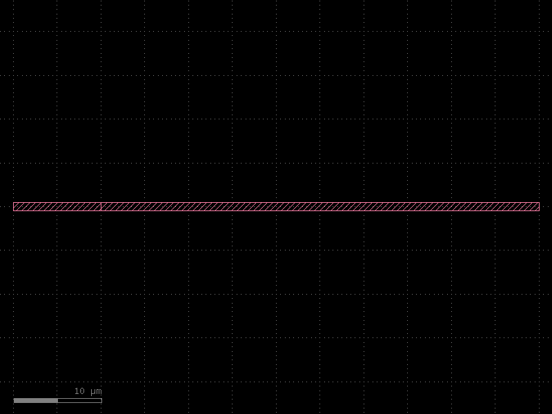

# Multi - KCLayout / PDK

You can also use multiple KCLayout objects as PDKs or Libraries of KCells and parametric KCell-Functions

## Use multiple KCLayout objects as PDKs/Libraries

KCLayouts can act as PDKs. They can be seamlessly incorporated into each other.

```python
import kfactory as kf


class LayerInfos(kf.LayerInfos):
    WG: kf.kdb.LayerInfo = kf.kdb.LayerInfo(1, 0)
    WGEX: kf.kdb.LayerInfo = kf.kdb.LayerInfo(2, 0)  # WG Exclude
    CLAD: kf.kdb.LayerInfo = kf.kdb.LayerInfo(4, 0)  # cladding
    FLOORPLAN: kf.kdb.LayerInfo = kf.kdb.LayerInfo(10, 0)


# Make the layout object aware of the new layers:
LAYER = LayerInfos()
kf.kcl.infos = LAYER

kcl_default = kf.kcl
```

Empty default KCLayout

```python
kcl_default.kcells
```

```python
# Create a default straight waveguide in the default KCLayout with dbu==0.001 (1nm grid)
s_default = kf.cells.straight.straight(width=1, length=10, layer=LAYER.WG)
```

```python
# There is now a a KCell in the KCLayout
kcl_default.kcells
```

```python
# Control the dbu is still 1nm
kcl_default.dbu
```

```python
# Create a new KCLayout to simulate PDK (could be package with e.g. `from test_pdk import kcl as pdk` or similar)
kcl2 = kf.KCLayout("TEST_PDK", infos=LayerInfos)
# Set the dbu to 0.005 (5nm)
kcl2.dbu = 0.005
kcl2.layout.dbu
```

```python
# Since it is a new KCLayout, it is empty
kcl2
```

```python
# Create a parametric KCell-Function for straights on the new PDK
sf2 = kf.factories.straight.straight_dbu_factory(kcl=kcl2)
```

```python
# Make an instance with
s2 = kcl2.factories["straight"](length=10000, width=200, layer=LAYER.WG)
s2.settings
```

```python
# The default kcl's straight uses 1nm grid and is therefore 1000dbu (1um) high and 10000dbu (10um) wide
print(f"{s_default.bbox().height()=}")
print(f"{s_default.dbbox().height()=}")
print(f"{s_default.bbox().width()=}")
print(f"{s_default.dbbox().width()=}")
# The test PDK uses a 5nm grid, so it will be 200dbu (1um) high and 10000dbu (50um) wide
print(f"{s2.bbox().height()=}")
print(f"{s2.dbbox().height()=}")
print(f"{s2.bbox().width()=}")
print(f"{s2.dbbox().width()=}")
```

```python
# The ports of the default kcl also have different width dbu dimensions, but are the same in um
s_default.ports.print()
s2.ports.print()
# But in um they are the same
s_default.ports.print(unit="um")
s2.ports.print(unit="um")
```

```python
# Both can be incorporated into the same KCell
c = kcl_default.kcell()
si_d = c << s_default
si_2 = c << s2
```

```python
si_2.connect("o1", si_d, "o2")
```

```python
c
```


